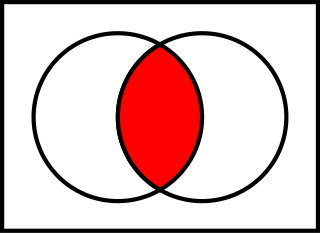
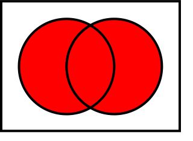
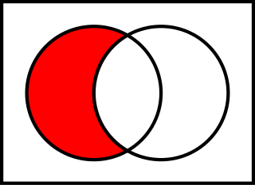
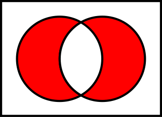

# Комбинаторика

## 1. Основные правила комбинаторики. Правило подсчёта количества комбинаторных объектов. Принцип Дирихле. Примеры.

При доказательстве комбинаторных теорем обычно признаются и используются несколько полезных **комбинаторных правил**, или **комбинаторных принципов**.

### **1.1. Правило сложения**

Интуитивно правило сложения утверждает, что если событие $A$ имеет $a$ возможных исходов, а событие $B$ имеет $b$ возможных исходов, причём только одно из этих событий может произойти, то общее число возможных результатов равно
$a+b$.

На языке теории множеств это правило означает, что размер объединения двух непересекающихся множеств равен сумме размеров этих множеств: если $A\cap B = \varnothing$, то $|A\cup B| = |A| + |B|$ (здесь и далее символ $|A|$ обозначает число элементов конечного множества $A$).

**Пример**. Выясним, сколько трёхзначных чисел содержат (в десятичной записи) ровно две девятки. Возможны три формата таких чисел:

$n99, n=1,2,3,\dots,8.$ Всего 8 вариантов.

$9n9, n=0,1,2,\dots,8.$ Всего 9 вариантов.

$99n, n=0,1,2,\dots,8.$ Всего 9 вариантов.

Согласно правилу сложения, всего таких чисел будет $8+9+9=26.$

### **1.2. Правило умножения**

Правило умножения – ещё один интуитивный принцип, утверждающий, что если есть $a$ способов сделать что-то и $b$ способов независимо сделать что-то другое, то существует $a\cdot b$ способов сделать и то, и другое.

**Пример**. Имеется $6$ красных, $8$ синих и $10$ зеленых кубиков. Выясним, сколькими способами они могут быть разложены в два ящика. Красные кубики можно распределить по двум ящикам так:

$$0+6; 1+5; 2+4; 3+3; 4+2; 5+1; 6+0.$$

Всего $7$ вариантов. Аналогично и независимо синие кубики дают $9$ вариантов, зелёные – $11$. По правилу умножения общее число вариантов равно $7\cdot 9 \cdot 11=693$ способа.

### **1.3. Принцип включения-исключения**

Принцип включения-исключения связывает размер объединения нескольких множеств с размером каждого множества и размерами их возможных пересечений. Простейший пример: если имеются два множества, то количество элементов в их объединении равно сумме количеств элементов во множествах за вычетом количества элементов в их пересечении:

$$|A \cup B| = |A| + |B| - |A \cap B|$$

Эта формула обобщает приведённое выше правило суммы. Вариант для трёх множеств:

$$|A\cup B\cup C| = |A| + |B| + |C| - |A\cap B| - |A\cap C| - |B\cap C| +  |A\cap B\cap C|$$

В общем случае принцип утверждает: если $A_1 \dots A_n$ – конечные множества, то:

$$
\begin{align}
\biggl|\bigcup_{i=1}^n A_i\biggr| & {} =\sum_{i=1}^n\left|A_i\right|
-\sum_{i,j\,:\,1 \le i < j \le n}\left|A_i\cap A_j\right| \\
& {}\qquad +\sum_{i,j,k\,:\,1 \le i < j < k \le n}\left|A_i\cap A_j\cap A_k\right|-\ \cdots\ + \left(-1\right)^{n-1} \left|A_1\cap\cdots\cap A_n\right|.
\end{align}
$$

**Пример**. В группе $40$ туристов. Из них $20$ человек говорят по-английски, $15$ – по-французски, $11$ – по-испански. Английский и французский знают $7$ человек, английский и испанский – $5$, французский и испанский – $3$. $2$ туриста говорят на всех трёх языках. Сколько человек группы не знают ни одного из этих языков? Подсчитаем по формуле включений-исключений общее число туристов, знающих хотя бы один из упомянутых языков: $20 + 15 + 11 - 7 - 5 - 3 + 2 = 33$. Следовательно, ответ: $40-33=7$.

### **1.4. Правило деления**

Комбинаторное определение: если задача решается с помощью процедуры, которая может быть выполнена $n$ способами, причём для каждого способа существуют $d-1$ неразличимых с ним результата, то всего существуют $n/d$ различных способов выполнить задачу.

На языке теории множеств: если конечное множество $A$ является объединением $n$ попарно непересекающихся подмножеств, каждое из которых содержит $d$ элементов, то $n = | A | / d$.

На языке функций: если функция $f$ отображает конечное множество $A$ на конечное множество $B,$ причём прообраз каждого значения $b \in B$ содержит ровно $d$ значений из A, то $|B| = |A| / d$.

**Пример**. Сколько существует различных способов усадить четырёх человек за круглый стол? Способы считаются различными, если хотя бы у одного человека сосед слева или справа отличается. Решение: если отбросить условие, то существует $4! = 24$ способа, но каждый способ имеет 3 "двойника", отличающиеся поворотом вокруг стола, и по условию задачи все они считаются за один способ. В итоге имеем $24/4=6$ *различных* способа.

### **1.5. Принцип Дирихле**

Принцип Дирихле в комбинаторике в простейшей формулировке гласит, что если $a$ объектов разместить в $b$ ящиках, причём $a>b,$ то по крайней мере один ящик будет содержать более одного объекта. С помощью этого принципа и его обобщений можно, например, продемонстрировать существование в множестве элемента с некоторыми специфическими свойствами.

**Пример**. Часть компании из $N$ людей $(N>1)$ обменивается рукопожатиями. Доказать, что в компании найдутся по крайней мере два человека, совершившие одинаковое число рукопожатий.

**Доказательство**. Определим $N$ "ящиков" $H_0, H_1 \dots H_{N-1}$ и занесём в ящик $H_k$ тех участников компании, которые совершили $k$ рукопожатий. Если ящик $H_0$ не пуст, то один или более участников компании не совершили ни одного рукопожатия, а, значит, ящик $H_{N-1}$ тогда пуст, потому что число совершивших рукопожатия получается тогда меньше $N$. Отсюда следует, что непустых ящиков всегда меньше, чем $N$, и, следовательно, по крайней мере один ящик соответствует двум или более людям.

### **1.6. Биективное доказательство**

Биективные доказательства используется для доказательства того, что два конечных множества имеют одинаковое число элементов; они особенно полезны в тех случаях, когда число элементов в одном множестве найти проще, чем в другом. В ходе доказательства строится биективная функция (взаимно однозначное соответствие) между этими множествами.

**Пример**. Докажем один из вариантов правила Паскаля: $C_{n+1}^{k+1} = C_n^{k+1} + C_n^k$, где $0\leqslant k\leqslant n-1$, а биномиальный коэффициент $C_n^m$ одновременно характеризует число $m$-элементных подмножеств натурального интервала $\mathbb{R_n} = \{1,2,\dots n\}$. Сопоставим каждому $(k+1)$ элементному подмножеству интервала $\mathbb{R_{n+1}}$ само это подмножество, если оно не содержит числа $n+1$, или его же за вычетом $n+1$, если содержит. Несложно показать, что для каждого $k$ получается биекция $(k+1)$-элементных подмножеств $\mathbb{R_{n+1}}$, с одной стороны, и подмножеств $\mathbb{R_n}$ длины $k+1$ и $k$, с другой стороны. Этот факт и отражает правило Паскаля.

### **1.7. Метод двойного счёта**

Двойной счет – это метод, который приравнивает два выражения для размера исследуемого множества, полученные двумя разными способами. Данный метод чрезвычайно полезен, например, для получения комбинаторных тождеств.

**Пример**. Подсчёт объектов в прямоугольной таблице по строкам и по столбцам приводит к одному и тому же результату, откуда следует коммутативность умножения.

### **1.8. Метод выделенного элемента**

Метод выделенного элемента отмечает некоторый "выделенный элемент" множества для доказательства нужного результата.

### **1.9. Производящая функция**

Производящая функция последовательности $\{a_1, a_2, a_3 \dots \}$ – это степенной ряд, коэффициенты которых соответствуют членам заданной последовательности.
$G(a_n; x)=\sum_{n=0}^{\infty}a_nx^n$.

Это представление часто позволяет применить к комбинаторным задачам мощные методы математического анализа.

### **1.10. Рекуррентное соотношение**

Рекуррентное соотношение определяет каждый член последовательности, кроме начального, через предыдущие члены. **Пример**: числа Фибоначчи.

Рекуррентное соотношение могут привести к ранее неизвестным свойствам последовательности, но обычно выражения в закрытой форме для членов последовательности более желательны.

___

## 2. Множества. Круги Эйлера, операции на множествах. Формула включений и исключений. Примеры.

### **2.1. Множество**

**Множество** – одно из ключевых понятий математики; представляющее собой набор, **совокупность** каких-либо (вообще говоря любых) объектов – **элементов** этого множества. Два множества равны тогда и только тогда, когда содержат в точности одинаковые элементы.

### **2.2. Элемент множества**

Объекты, из которых состоит множество, называют **элементами множества** или **точками множества**. Множества чаще всего обозначают заглавными буквами латинского алфавита, их элементы – строчными. Если $a$ – элемент множества $A$, то пишут $a \in A$ ("$a$ принадлежит $A$"). Если $a$ не является элементом множества $A$, то пишут $a \notin A$ ("$a$ не принадлежит $A$").

Если всякий элемент множества $A$ содержится в $B$, то пишут $A\subset B$ ("$A$ лежит в $B$, является его подмножеством"). Согласно теории множеств, если $X\subset Y$, то для всякого элемента $a\in Y$ определено либо $a\in X$, либо $a\not\in X$.

Таким образом, порядок записи элементов множества не влияет на само множество, то есть $\{6, 11\} = \{11, 6\}$. Помимо этого из вышесказанного следует, что для множества не определено число вхождений одинаковых элементов, то есть запись $A=\{11, 11, 6, 11, 6\}$, вообще говоря, не имеет смысла, если $A$ – множество. Однако корректной будет запись множества $B = \{11, \{11\}, \{6, 11\}, 6\}$.

### **2.3. Задание множества**

Существуют два основных способа задания множеств: перечислением элементов и их описанием.

#### **2.3.1. Перечисление**

Первый способ требует задать (перечислить) все элементы, входящие в множество. Например, множество $Y$ неотрицательных чётных чисел, меньших $10$, задастся: $Y = \{0, 2, 4, 6, 8\}$. Данный способ удобно применять лишь к ограниченному числу конечных множеств.

#### **2.3.2. Описание**

Второй способ применяется, когда множество нельзя или затруднительно задать перечислением (например, если множество содержит бесконечное число элементов). В таком случае его можно описать свойствами принадлежащих ему элементов.

Множество $Y\subset X$ задано, если указано условие $A(x)$, которому удовлетворяют все элементы $x\in X:x\in Y$, и которому не удовлетворяют $x\in X:x\notin Y$. Обозначают $Y=\{x\in X: A(x)\}.$

Например, график функции $f\colon X\to Y$ можно задать следующим образом:

$$\Gamma=\{(x,y)\in X\times Y: f(x)=y\},$$

где $\times$ – декартово произведение множеств.

### **2.4. Отношения между множествами**

Для множеств $A$ и $B$ могут быть заданы отношения:
* $A$ включено в $B$, если каждый элемент множества $A$ принадлежит также и множеству $B$:
* $$A \subseteq B \Leftrightarrow \forall a \in A\Rightarrow a \in B$$
* $A$ включает $B$, если $B$ включено в $A$:
* $$A \supseteq B \Leftrightarrow B \subseteq A$$
* $A$ равно $B$, если $A$ и $B$ включены друг в друга:
  * 123
* $$A = B \Leftrightarrow A \subseteq B,\,B \subseteq A$$
  * Для любых множеств $A = A$
  * Если $A = B$, то $B = A$
  * Если $A = B$, $B = C$, то $A = C$.

Иногда различают строгое включение ($A \subset B$) от нестрогого ($A \subseteq B$), различающиеся тем, что из $A \subset B\not\Rightarrow A=B$. Однако в большинстве случаев строгость включений не расписывают, отчего встречаются записи произвольных включений знаками строгого включения.

### **2.5. Операции над множествами**

Для наглядного представления операций часто используются диаграммы Венна, на которых представлены результаты операций над геометрическими фигурами как множествами точек.

#### **2.5.1. Основные операции**

**Пересечение** (множество общих точек):

$$A\cap B=\{x \mid x\in A,\, x\in B\}$$

**Объединение** (множество всех точек):

$$A\cup B=\{x,y \mid x\in A,\, y\in B\}$$

Объединение непересекающихся $A$ и $B$ ($A\cap B=\varnothing$) также обозначают $A+B=A\cup B$.

**Разность** (множество точек первого без второго):

$$A\setminus B=\{x \mid x\in A,\,x\notin B\}$$

**Симметрическая разность**:

$$A\bigtriangleup B \equiv A~\dot-~B=(A\cup B)\setminus(A\cap B)$$

**Дополнение** для $A\subset B$ (множество $B$ без $A$):

$$\overline A\equiv A^\complement =B\setminus A$$

Для операций над множествами также справедливы законы де Моргана:

$$A\backslash (B \cap C) = (A\backslash B) \cup (A\backslash C)$$

$$A \backslash (B \cup C)=(A\backslash B) \cap (A\backslash C)$$

#### **2.5.2 Приоритет операций**

Последовательность выполнения операций над множествами, как и обычно, может быть задана скобками. При отсутствии скобок сначала выполняются унарные операции (дополнение), затем – пересечения, затем – объединения, разности и симметрической разности. Операции одного приоритета выполняются слева направо. При этом надо иметь в виду, что в отличие от арифметических сложения и вычитания, для которых, в частности, верно, что $(a+b)-c = a + (b-c)$, для аналогичных операций над множествами это неверно. Например, если $A=\{1,3\}$, $B=\{1,2\}$, $C=\{2,3\}$, то $(A\cup B)\setminus C=\{1\}$, но, в то же время, $A\cup (B\setminus C)=\{1, 3\}$.

### **2.6. Декартово произведение**

Декартовым произведением множеств $A$ и $B$ называют множество, обозначаемое $(A\times B)$, элементами которого являются всевозможные пары элементов исходных множеств; $A\times B = \{(a,b) \mid a\in A,\,b\in B\}$.

Удобно представить, что элементы декартова произведения заполняют таблицу элементов, столбцы которой описывают все элементы одного множества, а строки, соответственно, другого.

### **2.7. Специальные множества**

* **Пустое множество** – $\varnothing$, $\emptyset$ или $\{\}$. Множество, не содержащее ни одного элемента.
* **Одноэлементное множество** (**синглетон**) – множество, состоящее из одного элемента. Например $\{0\}$ или $\{\{1,2,3\}\}$ (единственный элемент является множеством (которое само по себе не синглетон)).
* **Универсальное множество** (**универсум**) – множество, содержащее все мыслимые объекты. В связи с парадоксом Рассела данное понятие трактуется в настоящее время более узко как "множество, включающее все множества и объекты, участвующие в рассматриваемой задаче".

**Числовые множества**:
* **Множество натуральных чисел** $N$
* **Множество целых чисел** $Z$
* **Множество рациональных чисел** $Q$
* **Множество действительных чисел** $R$
* **Множество комплексных чисел** $C$

$$ N \subset Z \subset Q \subset R \subset C$$

### **2.8. Круги Эйлера**

**Диаграммы Эйлера** (**круги Эйлера**) – геометрическая схема, с помощью которой можно изобразить отношения между подмножествами, для наглядного представления. Первое их использование приписывают Леонарду Эйлеру. Используется в математике, логике, менеджменте и других прикладных направлениях.

### **2.9. Формула включения-исключения**

Принцип включения-исключения связывает размер объединения нескольких множеств с размером каждого множества и размерами их возможных пересечений. Простейший пример: если имеются два множества, то количество элементов в их объединении равно сумме количеств элементов во множествах за вычетом количества элементов в их пересечении:

$$|A \cup B| = |A| + |B| - |A \cap B|$$

Эта формула обобщает приведённое выше правило суммы. Вариант для трёх множеств:

$$|A\cup B\cup C| = |A| + |B| + |C| - |A\cap B| - |A\cap C| - |B\cap C| +  |A\cap B\cap C|$$

В общем случае принцип утверждает: если $A_1 \dots A_n$ – конечные множества, то:

$$
\begin{align}
\biggl|\bigcup_{i=1}^n A_i\biggr| & {} =\sum_{i=1}^n\left|A_i\right|
-\sum_{i,j\,:\,1 \le i < j \le n}\left|A_i\cap A_j\right| \\
& {}\qquad +\sum_{i,j,k\,:\,1 \le i < j < k \le n}\left|A_i\cap A_j\cap A_k\right|-\ \cdots\ + \left(-1\right)^{n-1} \left|A_1\cap\cdots\cap A_n\right|.
\end{align}
$$

___

## 3. Сочетания. Размещения, перестановки и сочетания. Бином Ньютона. Треугольник Паскаля. Размещения, перестановки и сочетания с повторениями.

___

## 4. Графы. Лемма о рукопожатиях. Связность графов. Деревья и их свойства. Эйлеровы и гамильтоновы графы. Планарные графы, формула Эйлера. Ориентированные графы, турниры.